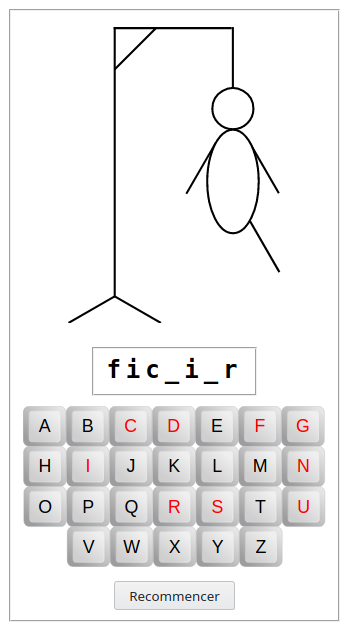

# Programmation du jeu du pendu

## Présentation

Les différentes étapes qui composent cette activité permettent de programmer un [jeu du pendu](https://fr.wikipedia.org/wiki/Le_Pendu_(jeu)) qui ressemblera à ça :

## Installation de l'activité

Suivre les indications de l'animateur ; il va t'indiquer la procédure exacte et probablement demander de cliquer l'un des deux liens suivants :

1. Dépôt *Replit* : <https://q37.info/s/7zcvn3fx> ;
2. fichier *Zip* : <https://q37.info/s/x74psdc4>.

Clique ensuite sur ce lien : [Étape *A*](./a).