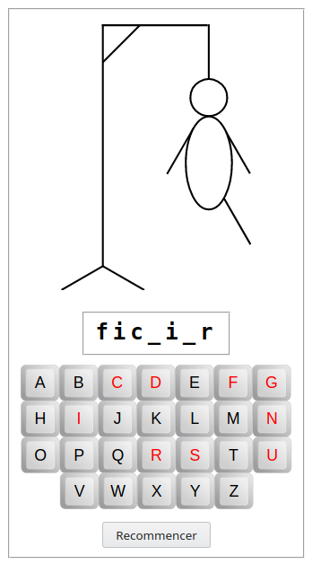
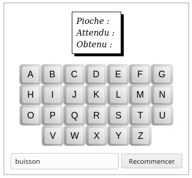
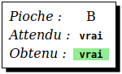
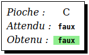
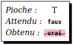

# Exercices de programmation du [jeu du pendu](https://fr.wikipedia.org/wiki/Le_Pendu_(jeu))

Les exercices proposés ici vont consister à programmer le jeu du pendu, qui va ressemble à ça :



Pour que l'exercice fonctionne correctement, tous débuterons par `from workshop.fr.a import *`

Demander au professeur comment procéder pour le lancement de l'exercice.

## 

## Exercice 1

Pour commencer, créer un fichier appelé `pendu.py`, et y copier le contenu suivant :

```python
from workshop.fr.a import *

MONTRER_MOT_SECRET = VRAI

def choisirMot():

go(globals())
```

La variable `MONTRER_MOT_SECRET` est une variable de type booléen. Lorsqu'elle est mise à `VRAI` (ou `True`), alors le programme va afficher le mot à deviner. Lorsqu'elle est mise à `FAUX`, alors le mot secret ne sera pas affiché.

Sans cette possibilité d'afficher le mot à deviner, il serait trés compliqué de tester le programme et de vérifier s'il fonctionne correctement. C'est pour cela que cette variable sera mis à `VRAI` tout au long du développement et de la mise au point du programme. Une fois que le programme sera au point, on la mettre à `FAUX`, pour que le mot à deviner ne soit plus affiché.

### Version 1

Le but de l'exercice est d'écrire une fonction qui retourne une chaîne de caractère, qui va être le mot à deviner. Pour commencer et se familiariser avec le lancement de l'exercice, on va lui faire retourner toujours le même mot.

Au lancement, selon l'environnement de développment utilisé, il y a directement l'interface de l'exercice qui va s'afficher, ou un [code QR](https://fr.wikipedia.org/wiki/Code_QR) sue lequel il faudra cliquer pour afficher cette interface.

Pour cette exercice, cette interface comprend un champ texte, qui va afficher le mot retourné par la fonction ci-dessus, et un bouton `Recommencer`. Quelque soit le contenu du champs texte, le fait de cliquer sur le bouton `Recommencer` va toujours afficher le même mot.

### Version 2

Pour simplifier les tests, on va offrir la possibilité de définir le mot à deviner grâce au champs texte. C'est-à-dire que lorsqu'on va cliquer sur le bouton `Recommencer`, c'est le texte dans champs texte qui va être utilisé comme mot secret.

Pour cela, on va modifier le code de l'exercice précédent pour obtenir ceci :

```python
from workshop.fr.a import *

MONTRER_MOT_SECRET = VRAI

def choisirMot(suggestion):
# Le code écrit dans le précédent exercice.

go(globals())
```

La fonction `choisirMot` prend maintenant un paramètre, alors qu'auparavent, elle n'en avait aucun. On est passé de `def choisirMot():` à `def choisirMot(suggestion):`. Le paramètre `suggestion` contient le contenu du champs texte.

Pour cet exercice, on va modifier le code existant de manière. Au lieu de retourner systématiquement le même mot, on ne va retourner ce mot que si `suggestion` est vide, sinon on retourne `suggestion`.

Voici le pseudo-code de cette fonction :


>  Si `suggestion` est vide  
> &nbsp;&nbsp;Retourner un mot quelconque  
> Sinon  
> &nbsp;&nbsp;Retourner `suggestion`

Dans cette nouvelle version, lorsque le champ texte, contient un mot, ce dernier est conservé dans ce champs lorsque l'on clique sur le bouton `Recommencer`. Si l'on clique sur ce bouton lorsque que le champs texte est vide, alors ce champs est rempli par le mot quelconque choisi.

### Version 3

Dans cette version, au lieu de toujours afficher le même mot lorsque le champs est vide, on va afficher un mot au hasard, qui est passé en paramètre à la fonction. On va ainsi modifier le code source pour obtenir ceci :

```python
from workshop.fr.a import *

MONTRER_MOT_SECRET = VRAI

def choisirMot(suggestion,motAuHasard):
# Le code écrit dans le précédent exercice.

go(globals())
```

Cette fois-ci, la fonction `choisirMot` a un paramètre `motAuHasard` qui contient un mot qui change à chaque appel de cette fonction. C'est un mot qui est choisi au hasard dans une liste, et il se peut parfois que ce soit le même mot qui est choisi plusieurs fois de suite, mais c'est rare.

Le pseudo-code de cette fonction est le suivant :

>  Si `suggestion` est vide  
> &nbsp;&nbsp;Retourner `motAuHasard`  
> Sinon  
> &nbsp;&nbsp;Retourner `suggestion`

Avec cette version, lorsque le champs texte contient un mot, c'est toujours celui-ci qui sera afficher lorsque l'on clique sur le bouton `Recommencer`, mais ce sera un mot qui changera à chaque fois lorsque l'on clique sur le bouton `Recommencer` alors que ce champs est vide.

### Version 4 (optionnelle)

Cette version permet de retourner comme mot à deviner un mot choisi dans une liste de ton choix.


```python
from workshop.fr.a import *

MONTRER_MOT_SECRET = VRAI

# Les mots donnés ici ne sont que des exemples.
# Tu peux y mettre les mots de ton choix.
DICTIONNAIRE = ("arbre", "maison", "bras") 

def choisirMot(suggestion):
# Le code écrit dans le précédent exercice.

go(globals())
```

La fonction `choisirMot` n'a de nouveau plus qu'un seul paramètre,`suggestion`, qui est, comme précédemment, le contenu du champs texte. Dans cette versnio, lorsque le champs texte est vide, et donc `suggestion`, alors la fonction doit retourner un des mots choisi au hasard dans `DICTIONNAIRE`.

Voici le pseudo-code

>  Si `suggestion` est vide  
> &nbsp;&nbsp;Retourner un mot choisi au hasard dans `DICTIONNAIRE`  
> Sinon  
> &nbsp;&nbsp;Retourner `suggestion`

Le programme doit maintenant se comporter comme précédemment, sauf que le mot qui est affiché lorsque l'on clique sur le bouton `Recommencer` alors que lme champs texte est vide sera l'un des mots contenu dans `DICTIONNAIRE`.

## Exercice 2

Dans cette exercice, on va maintenant écrire la fonction qui va tester si la pioche de l'utilisateur, le caractère qu'il a choisit, est présent ou  non dans le mot à deviner.

Pour cela on va reprendre le code écrit dans le précédent exercice, et on va opérer deux modifications. D'une part on va transformer la première ligne `from workshop.fr.a import *` en `from workshop.fr.b import *` (le `b` est remplacé par un `a`). D'autre part, on va rajouter la ligne `def lettreEstDansMot(lettre,mot):`

```python
from workshop.fr.a import *

…

def choisirMot(…):
    …

# Du début du fichier jusqu'à ici, on reprend le code
# du précedent exercice, à l'execption de la dernière ligne,
# qui reste la dernière, et le 'a' de la première ligne
# est transformé en 'b'.

def lettreEstDansMot(lettre,mot):

go(globals())
```

L'objectif de cet exercice est d'écrire le contenu de la fonction `lettreEstDansMot`. Le paramètre `lettre` est la lettre choisie par m'utilisateur, et `mot` est le mot à deviner.

Cette fonction doit retourner `VRAI` (ou `True`) si `lettre` est contenu dans `mot`, `FAUX` ou `False` dans le cas contraire.

Voici le pseudo-code correspondant :

> Si `lettre` est contenu dans `mot`  
> &nbsp;&nbsp;Retourner `VRAI`  
> Sinon  
> &nbsp;&nbsp;Retourner `FAUX`

orsque l'on lance le programme, voilà ce qui est affiché :



Le mot affiché dans le champs texte ne sera probablement pas *buisson*.

*Pioche* affichera la lettre sélectionné par l'utilisateur, *Attendu* affichera la valeur que la fonction `lettreEstDansMot` devrait retourner, et *Obtenu*, affichera ce qua la fonction `lettreEstDansMot` retourne effectivement.

Si l'utilisateur clique sur une lettre qui est contenu dans le mot, voici ce qui devrait s'afficher.




Si la fonction ne retourne pas la bonne valeur, et doit donc être corrigée, alors ceci s'affiche :


Si l'utilisateur clique sur une lettre qui n'est **pas** contenu dans le mot, voici ce qui devrait s'afficher.



Si la fonction ne retourne pas la bonne valeur, et doit donc être corrigée, alors ceci s'affiche :



Vérifier avec plusieurs mots différents et toutes les lettres de ce mot que ce qui est affiché dans *Obtenu* soit toujours surligne en vert. Sinon, retenir le mot et la lettre qui pose problème, corriger la fonction, et vérifier si le résultat avec le même mot la même lettre est correct.

## Exercice 3

…

Vérifier notamment avec des mots contenant plusieurs fois la même lettre.s
