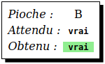
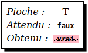
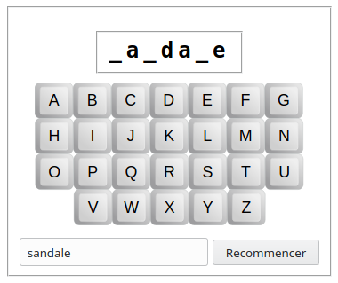

# Exercices de programmation du jeu du pendu

Les exercices proposés ici vont consister à programmer un [jeu du pendu](https://fr.wikipedia.org/wiki/Le_Pendu_(jeu), qui va ressembler à ça :


Le professeur vous indiquera comment procéder pour le lancement de l'exercice.


Dans le code de tous les exercices, vous aurez une variable nommée `MONTRER_MOT_SECRET` , qui est de type booléen. Lorsqu'elle est mise à `VRAI` (ou `True`), alors le programme va afficher le mot à deviner. Lorsqu'elle est mise à `FAUX`, alors le mot secret ne sera pas affiché.

Sans cette possibilité d'afficher le mot à deviner, il serait trés compliqué de tester le programme et de vérifier s'il fonctionne correctement. C'est pour cela que cette variable sera mis à `VRAI` tout au long du développement et de la mise au point du programme, et, une fois que le programme sera au point, on la mettre à `FAUX`, pour que le mot à deviner ne soit plus affiché.

## Exercice *a*

### Objectif

Se familiariser avec l'édition d'un fichier source, le lancement et l'arrêt du programme correspondant à l'exercice. 

### Préparation

Ouvrir le fichier `pendu.py`. Il devrait avoir le contenu suivant :

```python
from workshop.fr.a import *

MONTRER_MOT_SECRET = VRAI

def choisirMot():

go(globals())
```

### Tâches

Écrire le contenu de la fonction `choisirMot` pour qu'elle retourne une chaîne de caractères contenant un mot, toujours le même.

### Pseudo-code

> Retourner une chaîne de caractères contenant un mot.

### Aperçu


### Tests

Vérifier que, quelque soit le contenu du champs de saisie, les deux champs affichent toujours le mot retourné par la fonction `choisirMot` lorsque l'on clique sur le bouton `Recommencer`.

## Exercice *b*

### Objectifs

Offrir la possibilité de définir le mot à deviner grâce au champs texte. C'est-à-dire que lorsqu'on va cliquer sur le bouton `Recommencer`, c'est le texte contenu dans le champs de saisie qui va être utilisé comme mot secret.

### Préparation

- Dans la première ligne, remplacer le `a` par un `b` ;
- ajouter le paramètre `suggestion` dans la déclaration de la fonction `choisirMot`.

```python
from workshop.fr.b import *

…

def choisirMot(suggestion):
    …

go(globals())
```

### Tâches

Sachant que `suggestion` est une chaîne de caractères contenant ce qui a été saisi dans le champs de saisie, modifier le code de la fonction `choisirMot` pour que :

- lorsque  `suggestion` est vide, elle retourne une chaîne de caractères contenant un mot quelconque, toujours la même ;
- lorsque `suggestion` n'est pas vide, elle retourne `suggestion`.

### Pseudo-code

> Si `suggestion` est vide  
> &nbsp;&nbsp;Retourner un mot quelconque  
> Sinon  
> &nbsp;&nbsp;Retourner `suggestion`

### Aperçu

Le même que pour l'exercice précédent.

### Tests

- Lorsque l'on clique sur `Recommencer` alors que le champs de saisie est vide, c'est toujours le même mot qui doit être affiché dans les deux champs ;
- lorsque l'on clique sur `Recommencer` alors que le champs de saisie n'est pas vide, alors c'est le contenu de ce champs qui doit être affiché dans les deux champs.

## Exercice *c*

### Objectifs

Au lieu de toujours retourner le même mot lorsque le champs de saisie est vide,  on va retourner un mot au hasard fournit par le système.

### Préparation

- Dans la première ligne, remplacer le `b` par un `c` ;
- ajouter le paramètre `motAuHasard` dans la déclaration de la fonction `choisirMot`.

```python
from workshop.fr.b import *

…

def choisirMot(suggestion,motAuHasard):
    …

go(globals())
```

### Tâches

Sachant que :

- `suggestion` est le contenu du champs de saisie ;
- `motAuHasard` est un mot choisi au hasard ;

modifier la fonction `choisirMot` pour que :

- lorsque `suggestion` est vide, elle retourne `motAuHasard` ;
- lorsque `suggestion` n'est pas vide, elle retourne `suggestion`.

### Pseudo-code

> Si `suggestion` est vide  
> &nbsp;&nbsp;Retourner `motAuHasard`  
> Sinon  
> &nbsp;&nbsp;Retourner `suggestion`

### Aperçu

Le même que pour l'exercice précédent.

### Tests

Les mêmes que pour l'exercice précédent, sauf que, lorsque le champs de saisie est vide, ce ne sera pas toujours le même mot qui sera affiché. Il se peut qu'un même mot soit affiché deux fois (ou plus) à la suite, mais c'est rare.

## Exercice *d*

### Objectifs

Détection de la présence d'une lettre dns un mot.

Notions abordées :

- boucle *for* ;
- fonction `range` ;
- accès à un élément d'une chaîne de caractères par son indice.

### Préparation

- Dans la première ligne, remplacer le `c` par un `d` ;
- ajouter `def lettreEstDansMot(lettre,mot):` avant la dernière instruction du fichier.

```python
from workshop.fr.d import *

def choisirMot(suggestion):
    …

def lettreEstDansMot(lettre,mot):

go(globals())
```

### Tâches

Sachant que :

- `lettre` est la lettre choisie par le joueur ;

- `mot` est le mot à deviner ;

- écrire le code de la fonction `lettreEstDansMot` pour que :

- lorsque `lettre` est présent dans `mot`, elle retourne `VRAI` (ou `True`) ;

- lorsque `lettre` n'est **pas** présent dans `mot`, elle retourne `FAUX` (ou `False`).

### Pseudo-code

> Si `lettre` est contenu dans `mot`  
> &nbsp;&nbsp;Retourner `VRAI`  
> Sinon  
> &nbsp;&nbsp;Retourner `FAUX`

### Aperçu

Lorsque l'on lance le programme, voilà ce qui est affiché :


*Pioche* affichera la lettre sélectionné par l'utilisateur, *Attendu* affichera la valeur que la fonction `lettreEstDansMot` devrait retourner, et *Obtenu*, affichera ce qua la fonction `lettreEstDansMot` retourne effectivement.

Si l'utilisateur clique sur une lettre qui est contenue dans le mot, voici ce qui devrait s'afficher.



Si la fonction ne retourne pas la bonne valeur, et doit donc être corrigée, alors ceci s'affiche :


Si l'utilisateur clique sur une lettre qui n'est **pas** contenue dans le mot, voici ce qui devrait s'afficher.


Si la fonction ne retourne pas la bonne valeur, et doit donc être corrigée, alors ceci s'affiche :



### Tests

- Cliquer sur une lettre contenu dans le mot :
  - *Pioche* doit afficher la lettre cliquée,
  - *Attendu* doit afficher `vrai`,
  - *Obtenu* doit afficher `vrai` surligné en vert ;
- cliquer sur une lettre qui n'est **pas** contenu dans le mot :
  - *Pioche* doit afficher la lettre cliquée,
  - *Attendu* doit afficher `faux`,
  - *Obtenu* doit afficher `faux` surligné en vert.

Refaire les actions ci-dessus avec différentes lettre et différents mots. Si ce qui est affiché dans *Obtenu* est barré et surligné de rouge, alors le code de la fonction `lettreEstDansMot` est incorrect. Noter le mot et le lettre qui pose problème, corriger la fonction, et ressayer le mot et la lettre pour vérifier que le bug a été corrigé.

## Exercice *e*

### Objectifs

Affichage du masque, c'est-à-dire du mot à deviner avec dissimulation des lettres qui n'ont pas encore encore été trouvées par le joueur.

### Préparation

```python
from workshop.fr.e import *

…

def lettreEstDansMot(lettre,mot):
    …

def donnerMasque(mot,pioches):

go(globals())
```

### Tâches

Sachant que :

- `mot` est une chaîne de caractères contenant le mot à deviner ;
- `pioches` étant une chaîne de caractère contenant les lettres choisies par le joueur ;

écrire le code de la fonction `donnerMasque` pour qu'elle retourne `mot`, mais dont les lettres qui ne sont pas contenus dans `pioches` sont remplacées par le caractère `_`.

### Pseudo-code

> Mettre une chaîne de caractères vide dans `masque` 
> 
> Pour `lettre` étant chaque lettre dans `mot`  
> &nbsp;&nbsp;Si `lettre` est dans `pioches`  
> &nbsp;&nbsp;&nbsp;&nbsp;Ajouter `lettre` à `masque`  
> &nbsp;&nbsp;Sinon  
> &nbsp;&nbsp;&nbsp;&nbsp;Ajouter le caractère **`_`** à `masque`
> 
> Retourner `masque`

### Aperçu



### Tests

- Au lancement, le masque doit être constitué d'un nombre de `_` égal au nombre de caractères du mot à deviner ;
- cliquer sur une lettre contenu dans le mot à deviner : toutes les occurrences de cette lettre apparaissant dans le mot à deviner doivent être dévoilées, en plus des lettres déjà dévoilées ;
- cliquer sur une lettre qui n'est **pas** contenue dans le mot à deviner : rien ne doit se passer ;
- tester des mots contenant plusieurs fois la même lettre pour vérifier que toutes les occurrences d'une même lettre soient bien dévoilées.

## Exercice *f*

### Objectif

Dessiner le corps du pendu en fonction du nombre d'erreurs, c'est-à-dire du nombre de lettres piochées par le joueur qui ne sont pas contenues dans le mot à deviner)

### Préparation

```python
from workshop.fr.f import *

…

def donnerMasque(mot,pioches):
    …

def majCorps(nombreErreurs):    


go(globals())
```

### Tâche

Sachant que `nombreErreurs` est le nombre d'erreurs commises par le joueur, c'est-à-dire le nombre de lettres qu'il a choisi est qui ne sont pas contenus dans le mot à deviner; écrire le code de la fonction `majCorps` pour qu'elle dessine la partie du corps correspondant au nombre d'erreurs. Pour cela, on dispose de la fonction `dessinerPartieCorps` qui peut prendre, comme paramètre, une des valeurs suivantes :

```python
P_TETE          # pour dessiner la tête,
P_TRONC         # pour dessiner le tronc,
P_BRAS_GAUCHE   # pour dessiner le bras gauche,
P_BRAS_DROIT    # pour dessiner le bras droit,
P_PIED_GAUCHE   # pour dessiner le pied gauche,
P_PIED_DROIT    # pour dessiner le pied droit,
P_VISAGE        # pour dessiner la visage.
```

`maj` signifie *mise-à-jour*, car la fonction est appelée à chaque nouvelle erreur, cela veut dire que la valeur du paramètre `nombreErreurs` est incrémenté d'un apple à l'autre. Aussi ne va-t-on pas redessiné tous le corps, mais juste la partie correspondant au nombre d'erreurs.

### Pseudo-code

> Si `nombreErreurs` est égal à 1  
> &nbsp;&nbsp;Dessiner la tête  
> Sinon si `nombreErreurs` est égal à 2  
> &nbsp;&nbsp;Dessiner le tronc  
> Sinon si `nombreErreur` est égal à 3  
> &nbsp;&nbsp;Dessiner le bras gauche  
> 
> *et ainsi de suite pour dessiner le bras droit, le pied gauche, le pied droit et enfin le visage.*

### Aperçu


### Tests

- Pour chaque lettre contenue dans le mot à deviner, vérifier que le programme se comporte comme dans l'exercice précédent ;
- pour chaque lettre **non** contenue dans le mot à deviner, vérifier que le dessin du corps du pendu se complète peu à peu.
