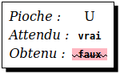
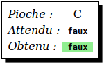

# Exercices de programmation du jeu du pendu

## Présentation

La série d'exercices qui suit permet de programmer une version du [jeu du pendu](https://fr.wikipedia.org/wiki/Le_Pendu_(jeu)) jouable sur smartphone, et qui ressemblera à ça :


Le professeur vous indiquera comment accèder aux exercices et les utiliser. Ce sera probablement en utilisant l'un des deux liens ci-dessous :
- pour travailler sur les exercices dans un environnement de développement en ligne (session *Repl.it*) : <https://q37.info/s/jzw7knww> ;
- pour travailler sur les exercices en utilisant l'interpréteur *Python* installé sur un ordinateur (fichier *ZIP*) : <https://q37.info/s/xht7cvwk>.

## Exercice *a*

### Objectifs

Se familiariser avec l'édition d'un fichier source, ainsi que le lancement et l'arrêt du jeu. 

### Préparation

Ouvrir le fichier `pendu.py`. Il devrait avoir le contenu suivant :

```python
from workshop.fr.a import *

MONTRER_MOT_SECRET = VRAI

def choisirMot():

go(globals())
```

La variable booléenne `DIVULGUER_MOT_SECRET` permet de configurer le jeu pour qu'il affiche le mot à deviner. Sans cette possibilité, il serait compliqué de tester le jeu pour vérifier s'il fonctionne correctement.  On donnera à cette variable la valeur `VRAI` (ou `True`) tout au long du développement et de la mise au point du jeu, et `FAUX` (ou `False`) une fois que le jeu sera au point, pour que le mot à deviner ne soit plus affiché.

*Nota* : lancer l'exécution de ce fichier en l'état provoquera l'affichage d'un message d'erreur.

### Tâches

Écrire le contenu de la fonction `choisirMot` pour qu'elle retourne toujours la même chaîne de caractères contenant un mot. 

### Pseudo-code

> Retourner un mot contenu dans une chaîne de caractères.

### Aperçu


### Tests

- Cliquer sur le bouton `Recommencer` et vérifier que les deux champs affichent le mot retourné par la fonction `choisirMot` ;
- changer le contenu du champ de saisie, cliquer sur le bouton `Recommencer`, et vérifier que les deux champs affiche le même mot que ci-dessus.

## Exercice *b*

### Objectifs

Offrir la possibilité de définir le mot à deviner grâce au champ de saisie. C'est-à-dire que, lorsqu'on va cliquer sur le bouton `Recommencer`, c'est le texte contenu dans le champ de saisie qui va être utilisé comme mot à deviner, et donc affiché dans les deux champs.

### Préparation

- Dans la première ligne, remplacer le `a` par un `b` ;
- ajouter le paramètre `suggestion` dans la déclaration de la fonction `choisirMot`.

```python
from workshop.fr.b import *

…

def choisirMot(suggestion):
    …

go(globals())
```

### Tâches

Sachant que :

- `suggestion` est une chaîne de caractères contenant ce qui a été saisi dans le champ de saisie  ;

modifier le code de la fonction `choisirMot` pour que :

- lorsque  `suggestion` est vide, elle retourne une chaîne de caractères contenant un mot quelconque, toujours le même (réutiliser le code écrit dans l'exercice précédent) ;
- lorsque `suggestion` n'est **pas** vide, elle retourne `suggestion`.

### Pseudo-code

> Si `suggestion` est vide  
> &nbsp;&nbsp;Retourner un mot quelconque  
> Sinon  
> &nbsp;&nbsp;Retourner `suggestion`

### Aperçu

Le même que pour l'exercice précédent.

### Tests

- Lorsque l'on clique sur `Recommencer` alors que le champ de saisie est vide, c'est toujours le même mot qui doit être affiché dans les deux champs ;
- lorsque l'on clique sur `Recommencer` alors que le champ de saisie n'est **pas** vide, alors c'est le contenu de ce champ qui doit être affiché dans les deux champs.

## Exercice *c*

### Objectifs

Au lieu de toujours retourner le même mot lorsque le champ de saisie est vide, on va retourner un mot au hasard fournit par le système.

### Préparation

- Dans la première ligne, remplacer le `b` par un `c` ;
- ajouter le paramètre `motAuHasard` dans la déclaration de la fonction `choisirMot`.

```python
from workshop.fr.c import *

…

def choisirMot(suggestion,motAuHasard):
    …

go(globals())
```

### Tâches

Sachant que :

- `suggestion` est le contenu du champ de saisie ;
- `motAuHasard` est un mot choisi au hasard ;

modifier la fonction `choisirMot` pour que :

- lorsque `suggestion` est vide, elle retourne `motAuHasard` ;
- lorsque `suggestion` n'est **pas** vide, elle retourne `suggestion`.

### Pseudo-code

> Si `suggestion` est vide  
> &nbsp;&nbsp;Retourner `motAuHasard`  
> Sinon  
> &nbsp;&nbsp;Retourner `suggestion`

### Aperçu

Le même que pour l'exercice précédent.

### Tests

Les mêmes que pour l'exercice précédent, sauf que, lorsque le champ de saisie est vide, ce ne sera pas toujours le même mot qui sera affiché. Il se peut qu'un même mot soit affiché deux fois (ou plus) à la suite, mais c'est rare.

## Exercice *d*

### Objectifs

Détecter la présence d'une lettre dans un mot.

### Préparation

- Dans la première ligne, remplacer le `c` par un `d` ;
- ajouter `def lettreEstDansMot(lettre,mot):` avant la dernière instruction du fichier.

```python
from workshop.fr.d import *

…

def choisirMot(…):
    …

def lettreEstDansMot(lettre,mot):

go(globals())
```

### Tâches

Sachant que :

- `lettre` est la lettre choisie par le joueur ;
- `mot` est le mot à deviner ;

écrire le code de la fonction `lettreEstDansMot` pour que :

- lorsque `lettre` est présent dans `mot`, elle retourne `VRAI` (ou `True`) ;
- lorsque `lettre` n'est **pas** présent dans `mot`, elle retourne `FAUX` (ou `False`).

### Pseudo-code

> Si `lettre` est contenu dans `mot`  
> &nbsp;&nbsp;Retourner `VRAI`  
> Sinon  
> &nbsp;&nbsp;Retourner `FAUX`

### Aperçu

Lorsque l'on lance le jeu, voilà ce qui est affiché :


- *Pioche* affiche la lettre sélectionnée par l'utilisateur ;
- *Attendu* affiche la valeur que la fonction `lettreEstDansMot` devrait retourner ;
- *Obtenu* affiche ce que la fonction `lettreEstDansMot` retourne effectivement.

Si l'utilisateur clique sur une lettre qui est contenue dans le mot, voici ce qui devrait s'afficher.


Si la fonction ne retourne pas la bonne valeur, et doit donc être corrigée, alors ceci s'affiche :



Si l'utilisateur clique sur une lettre qui n'est **pas** contenue dans le mot, voici ce qui devrait s'afficher :



Si la fonction ne retourne pas la bonne valeur, et doit donc être corrigée, alors ceci s'affiche :


### Tests

- Cliquer sur une lettre contenue dans le mot :
  
  - *Pioche* doit afficher la lettre cliquée ;
  - *Attendu* doit afficher `vrai` ;
  - *Obtenu* doit afficher `vrai` surligné en vert ;

- cliquer sur une lettre qui n'est **pas** contenue dans le mot :
  
  - *Pioche* doit afficher la lettre cliquée ;
  - *Attendu* doit afficher `faux` ;
  - *Obtenu* doit afficher `faux` surligné en vert.

- refaire les actions ci-dessus avec différentes lettres et différents mots.

Si ce qui est affiché dans *Obtenu* est barré et surligné de rouge, alors le code de la fonction `lettreEstDansMot` est incorrect. Noter le mot et le lettre qui posent problème, corriger la fonction, et ressayer le mot et la lettre pour vérifier que le bug a été corrigé.

## Exercice *e*

### Objectifs

Affichage du masque, c'est-à-dire du mot à deviner avec dissimulation des lettres qui n'ont pas encore encore été trouvées par le joueur.

### Préparation

- Dans la première ligne, remplacer le `d` par un `e` ;
- ajouter `def donnerMasque(mot,pioches):` avant la dernière instruction du fichier.

```python
from workshop.fr.e import *

…

def lettreEstDansMot(lettre,mot):
    …

def donnerMasque(mot,pioches):

go(globals())
```

### Tâches

Sachant que :

- `mot` est une chaîne de caractères contenant le mot à deviner ;
- `pioches` étant une chaîne de caractère contenant les lettres choisies par le joueur ;

écrire le code de la fonction `donnerMasque` pour qu'elle retourne `mot`, mais dont les lettres qui ne sont pas contenus dans `pioches` sont remplacées par le caractère `_`.

### Pseudo-code

> Mettre une chaîne de caractères vide dans `masque` 
> 
> Pour `lettre` étant chaque lettre dans `mot`  
> &nbsp;&nbsp;Si `lettre` est dans `pioches`  
> &nbsp;&nbsp;&nbsp;&nbsp;Ajouter `lettre` à `masque`  
> &nbsp;&nbsp;Sinon  
> &nbsp;&nbsp;&nbsp;&nbsp;Ajouter le caractère **`_`** à `masque`
> 
> Retourner `masque`

### Aperçu


### Tests

Sachant que le contenu du masque est affiché dans le cadre au-dessus du clavier :

- au lancement, le masque doit être constitué d'un nombre de `_` égal au nombre de caractères du mot à deviner ;
- cliquer sur une lettre contenue dans le mot à deviner : toutes les occurrences de cette lettre contenus dans le mot à deviner doivent être dévoilées, en plus des lettres déjà dévoilées ;
- cliquer sur une lettre qui n'est **pas** contenue dans le mot à deviner : rien ne doit se passer ;
- tester des mots contenant plusieurs fois la même lettre pour vérifier que toutes les occurrences d'une même lettre soient bien dévoilées.

## Exercice *f*

### Objectif

Dessiner le corps du pendu en fonction du nombre d'erreurs, c'est-à-dire du nombre de lettres choisies par le joueur qui ne sont pas contenues dans le mot à deviner.

### Préparation

- Dans la première ligne, remplacer le `e` par un `f` ;
- ajouter `def majCorps(nombreErreurs)` avant la dernière instruction du fichier.

```python
from workshop.fr.f import *

…

def donnerMasque(mot,pioches):
    …

def majCorps(nombreErreurs):    

go(globals())
```

### Tâche

Sachant que : 

- `nombreErreurs` est le nombre d'erreurs commises par le joueur, c'est-à-dire le nombre de lettres qu'il a choisi est qui ne sont pas contenus dans le mot à deviner ;

écrire le code de la fonction `majCorps` pour qu'elle dessine la partie du corps correspondant au nombre d'erreurs.

Pour cette tâche, utiliser la fonction `dessinerPartieCorps` qui prend, comme paramètre, une des valeurs suivantes :

```python
P_TETE          # pour dessiner la tête,
P_TRONC         # pour dessiner le tronc,
P_BRAS_GAUCHE   # pour dessiner le bras gauche,
P_BRAS_DROIT    # pour dessiner le bras droit,
P_PIED_GAUCHE   # pour dessiner le pied gauche,
P_PIED_DROIT    # pour dessiner le pied droit,
P_VISAGE        # pour dessiner la visage.
```

`maj` signifie *mise-à-jour*, car la fonction est appelée à chaque nouvelle erreur. Cela veut dire que la valeur du paramètre `nombreErreurs` est incrémenté d'un appel à l'autre. Aussi ne va-t-on pas redessiner tout le corps, mais juste la partie correspondant au nombre d'erreurs.

### Pseudo-code

> Si `nombreErreurs` est égal à 1  
> &nbsp;&nbsp;Dessiner la tête  
> Sinon si `nombreErreurs` est égal à 2  
> &nbsp;&nbsp;Dessiner le tronc  
> Sinon si `nombreErreurs` est égal à 3  
> &nbsp;&nbsp;Dessiner le bras gauche  
> 
> *et ainsi de suite pour dessiner le bras droit, le pied gauche, le pied droit et enfin le visage.*

### Aperçu


### Tests

- Pour chaque lettre contenue dans le mot à deviner, vérifier que le jeu se comporte comme dans l'exercice précédent ;
- pour chaque lettre **non** contenue dans le mot à deviner, vérifier que le dessin du pendu se complète peu à peu.

## Exercice *g*

### Objectif

Simplification de la fonction `majCorps`, grâce à l'utilisation d'un *tuple*.

### Préparation

- Dans la première ligne, remplacer le `f` par un `g`.

```python
from workshop.fr.g import *

…

def majCorps(nombreErreurs):    
    …

go(globals())
```


### Tâches

- Créer un *tuple* appelé `PARTIES_CORPS` contenant les constantes `P_…` listées dans l'exercice précédent, dans l'ordre dans lequel les parties du corps correspondantes doivent être dessinées ;
- modifier la fonction `majCorps` pour qu'elle réalise la même tâche que dans l'exercice précédent, mais en utilisant le *tuple* ci-dessus.

### Pseudo-code

> Affecter à `PARTIES_CORPS` un *tuple* contenant les constantes `P_…`
>
> Dessiner la partie du corps stockée dans `PARTIES_CORPS` correspondant à `nombreErreurs`

### Aperçu

Le même que pour l'exercice précédent.

### Test

Les mêmes que pour l'exercice précédent.

## Exercice *h*

### Objectif

Lorsque le dernier membre du corps du pendu est dessiné, le visage doit également être dessiné, pour indiquer que la partie est perdue.

### Préparation

- Dans la première ligne, remplacer le `g` par un `h`.

```python
from workshop.fr.h import *

…

def majCorps(nombreErreurs):    
    …

go(globals())
```

### Tâches

- Retirer du *tuple* `PARTIES_CORPS` la constante `P_VISAGE` ;
- modifier le code de la fonction `majCorps` pour dessiner explicitement le visage (utilisation de la constante `P_VISAGE`) lorsque la dernière partie du corps, tel que contenue dans `PARTIES_CORPS`, est dessinée.

On pourra se servir de la taille du *tuple* pour détecter quand est dessinée la dernière partie du corps.

### Pseudo-code

> Dessiner la partie du corps correspondant à `nombreErreurs`
>
> Si `nombreErreur` supérieur au nombre d'erreurs autorisées  
> &nbsp;&nbsp;Dessiner le visage

### Aperçu

Le même que pour l'exercice précédent.

### Tests

Reprendre les tests de l'exercice précédent, et vérifier qu'au lieu d'être dessiné à part, le visage est dessiné en même temps que la dernière partie du corps.

## Exercice *i*

### Objectifs

Gérer la lettre sélectionnée par le joueur, de manière à mettre à jour, soit le masque, soit le dessin du pendu en fonction de la présence ou de l'absence dans le mot secret de la lettre sélectionnée (piochée) par le joueur.

### Préparation

- Dans la première ligne, remplacer le `h` par un `i` ;
- ajouter les lignes suivantes avant la dernière instruction du fichier :
  - `bonnesPioches = ""`,
  - `nbErreurs = 0`,
  - `def raz(suggestion,motAuHasard):`,
  - `def traiterPioche(pioche,motSecret):`.
  
```python
from workshop.fr.i import *

…


def majCorps(nombreErreurs):    
    …


bonnesPioches = ""
nbErreurs = 0


def raz(suggestion,motAuHasard):


def traiterPioche(pioche,motSecret):


go(globals())
```

### Tâches

- `bonnesPioches` est une **chaîne de caractères** globale qui contiendra les lettres sélectionnées par le joueur et qui sont contenues dans le mot secret ;
- `nbErreurs` est un **entier** global qui contiendra le nombre de lettres sélectionnées par le joueurs et qui ne sont **pas** contenues dans le mot secret.

#### Fonction `raz`

Sachant que :

- `suggestion` est le contenu du champ de saisie ;
- `motAuHasard` est un mot choisi au hasard ;
- cette fonction est appelée :
  - à chaque nouvelle instance du jeu,
  - à chaque fois que le joueur clique sur le bouton `Recommencer` pour recommencer une nouvelle partie,

écrire le code de cette fonction pour :

- réinitialiser les deux variables globales `bonnesPioches` et `nbErreurs` ;
- stocker dans `motSecret` un nouveau mot secret, en utilisant l'une des fonctions développées précédemment ;
- afficher le masque correspondant au mot stocké dans `motSecret` :
  - en utilisant l'une des fonctions développées précédemment pour déterminer le masque,
  - en utilisant la fonction `afficher` pour afficher le masque (lui passer en paramètre le masque en question) ;
- retourner `motSecret`.

Contrairement à `bonnesPioches` et `nbErreurs`, qui sont des variable **globales**, `motSecret` devra être une variable **locale**.

Le dessin du pendu est effacé automatiquement lorsque l'on clique sur `Recommencer`.

#### Fonction `traiterPioche`

Sachant que :
- `pioche` contient la lettre sélectionnée par le joueur ;
- `motSecret` contient le mot à deviner tel que retourné par la fonction `raz(…)` ci-dessus ;

écrire le code de cette fonctions pour :
- si `pioche` est contenu dans `motSecret` :
  - ajouter `pioche` dans la la variable globale `bonnePioches`,
  - afficher le nouveau masque correspondant,
- si `pioche` n'est **pas** contenu dans `motSecret` :
  - incrémenter la variable globale `nbErreurs`,
  - mettre à jour le dessin du pendu.

Il faudra, bien entendu, utiliser les fonctions développées dans les précedents exercices.

### Pseudo-code

#### Fonction `raz`

> Initialiser variables globales
>
> Choisir un nouveau mot à deviner
> 
> Afficher le masque correspondant à ce nouveau mot à deviner
> 
> Retourner ce nouveau mot à deviner

#### Fonction `traiterPioche`

> Si `pioche` est contenu dans `motSecret`  
> &nbsp;&nbsp;Ajouter `pioche` à `bonnePioches`  
> &nbsp;&nbsp;Afficher le nouveau masque  
> Sinon  
> &nbsp;&nbsp;Incrémenter `nbErreurs`  
> &nbsp;&nbsp;Complèter le dessin du pendu

### Aperçu

Identique à celui de l'exercice précédent.

### Tests

Identiques à ceux de l'exercice précédent.

## Exercice *j*

### Objectifs

Comme vous avez pu le constater, la manière dont est codé l'exercice precédent ne permet  pas de jouer à ce jeu à plusieurs simultanément. L'objectif de cet exercice est de remédier à cela, grâce à la programmation objet.

### Préparation

- Dans la première ligne, remplacer le `i` par un `j` ;
- supprimer la déclaration des variables `bonnesPioches` et `nbErreurs` ;
- là où il y avait la déclaration de ces variables, placer le code suivant :
```python
class Pendu:
  def raz(self):
    self.bonnesPioches = ""
    self.nbErreurs = 0

  def __init__(self):
    self.raz()
    
  def traiterEtTesterPioche(self,pioche,motSecret):
```
- dans les fonctions `raz(…)` et `traiterPioches(…)`
  - enlever la ligne `global bonnesPioches, nbErreurs`,
  - ajouter le paramètre `pendu` en première position dans leurs déclarations respectives.

```python
from workshop.fr.h import *

…


def majCorps(nombreErreurs):    
    …

# Les déclarations des variables 'bonnesPioches' et 'nbErreurs'
# qui étaient positionnées ici doivent être supprimées.

class Pendu:
  def raz(self):
    self.bonnesPioches = ""
    self.nbErreurs = 0

  def __init__(self):
    self.raz()
    
  def traiterEtTesterPioche(self,pioche,motSecret):


def raz(pendu,suggestion,motAuHasard):
# La ligne 'global bonnesPioches, nbErreurs' présente ici doit être supprimée.
# Le reste du code doit être conservé.
    …
  

def traiterPioche(pendu,pioche,motSecret):
# La ligne 'global bonnesPioches, nbErreurs' présente ici doit être supprimée.
# Le reste du code doit être conservé.
    …

go(globals())    
```

### Tâches

Au lieu d'être globales à tout le programme, les variables `bonnesPioches` et `nbErreurs` sont maintenant rattachées à une classe appelée `Pendu`. Une instance de cette classe est crée pour chaque joueur, et est accessible via le paramètre `pendu` passé aux fonctions `raz(…)` et `traiterPioche(…)`.

Pour accèder aux membre de cette instance, on utilisera l'écriture `pendu.<variable ou méthode>`. Ainsi, `pendu.nbErreurs` donne accès à la variable `nbErreurs` de la classe `Pendu`, et `pendu.raz()` appellera la méthode `raz` de cette même classe.

Dans le cas de méthodes, le premier paramètre, nommé par convention `self`, est l'instance à partir de laquelle cette fonction a été appelée. Ainsi, en appelant `pendu.raz()`, le paramètre `self` de la méthode `raz` référence la même instance de la classe `Pendu` que la variable `pendu`.

#### Méthode `Pendu.traiterEtTesterPioche`

Sachant que :

- `self` est l'instance de la classe `Pendu` ;
- `pioche` contient la lettre sélectionnée par le joueur ;
- `motSecret` étant le mot à deviner ;

écrire le code de la méthode `Pendu.traiterEtTesterPioche` pour qu'elle :

- remplisse les même fonctionnalités que la fonction `traiterPioche(…)` de l'exercice précedent, mais en utilisant le paramètre `self` pour accèder aux variables `bonnesPioches` et `nbErreurs` de la classe `Pendu` (`self.bonnesPioches` et `self.nbErreurs`) ;
- retourne :
  - `VRAI` lorsque `pioche` est présent dans `motSecret`,
  - `FAUX` lorsque `pioche` n'est **pas** présent dans `motSecret`.

#### Fonction `raz`

Sachant que :

- `pendu` est une instance de la classe `Pendu` ;
- `suggestion` est le contenu du champ de saisie ;
- `motAuHasard` est un mot choisi au hasard ;
- cette fonction est appelée dans les mêmes conditions que la fonction homonyme de l'exercice précédent ;

écrire le code de la fonction `raz` de manière à ce qu'elle remplisse les même fonctionnalités que dans l'exercice précédent, en utilisant la méthode `Pendu.raz` pour réinitialiser les variables.

#### Fonction `traiterPioche`

Sachant que :

- `pendu` est une instance de la classe `Pendu` ;
- `pioche` contient la lettre sélectionnée par le joueur ;
- `motSecret` contient le mot à deviner tel que retourné par la fonction `raz(…)` ci-dessus ;

écrire le code de la fonction `traiterPioche` de manière à ce qu'elle remplisse les même fonctionnalités que dans l'exercice précédent, en utilisant la méthode `Pendu.traiterEtTesterPioche` développée précédemment.

### Pseudo-code

#### Méthode `Pendu.traiterEtTesterPioche`

> Si `pioche` est contenu dans `motSecret`  
> &nbsp;&nbsp;Ajouter `pioche` à `bonnePioches`  
> &nbsp;&nbsp;Retourner `VRAI`  
> Sinon  
> &nbsp;&nbsp;Incrémenter `nbErreurs`  
> &nbsp;&nbsp;Retourner `FAUX`


#### Fonction `raz`


> Réinitialiser `pendu`
>
> Choisir un nouveau mot à deviner
>
> Afficher le masque correspondant à ce nouveau mot à deviner
>
> Retourner ce nouveau mot à deviner


#### Fonction `traiterPioche`

> Si `pendu.traiterEtTesterPioche(pioche,motSecret)` retourne `VRAI`  
> &nbsp;&nbsp;Afficher le nouveau masque  
> Sinon  
> &nbsp;&nbsp;Complèter le dessin du pendu

#### Aperçu

Identique à celui de l'exercice précedent.

#### Tests

Identiques à ceux de l'exercice précédent, en vérifiant que cela fonctionne également avec plusieurs joueurs simultanés.

## Exercice *k*

### Objectifs

Prendre en charge la gestion du mot à deviner ainsi que sa divulgation ou non en fonction de la valeur de la variable globale `DIVULGUER_MOT_SECRET`.

### Préparation

- Dans la première ligne, remplacer le `j` par un `k` ;
- dans la méthode `Pendu.raz`, ajouter les paramètres `suggestion` et `motAuHasard` ;
- dans le constructeur `Pendu.__init__(self)`, ajouter la ligne `self.motSecret = ""` ;
- retirer le paramètre `motSecret` de la fonction `traiterPioche`.

```python
from workshop.fr.k import *

…


def majCorps(*args):
  …


class Pendu:
  def raz(self,suggestion,motAuHasard):
    …

  def __init__(self):
    self.motSecret = ""
    self.bonnesPioches = ""
    self.nbErreurs = 0
    
  def traiterEtTesterPioche(self,pioche):
    …


def raz(pendu,suggestion,motAuHasard):
  …
  

def traiterPioche(pendu,pioche):
  …


go(globals())
```

### Tâches

#### Méthode `Pendu.raz`

Sachant que :

- `pendu` est une instance de la classe `Pendu` ;
- `suggestion` est le contenu du champ de saisie ;
- `motAuHasard` est un mot choisi au hasard ;

Modifier la méthode `Pendu.raz`, en s'inspirant de la **fonction** `raz`, pour stocker, dans la variable membre `Pendu.motSecret`, un nouveau mot à deviner.

#### Fonction `raz`

Sachant que :

- `pendu` est une instance de la classe `Pendu` ;
- `suggestion` est le contenu du champ de saisie ;
- `motAuHasard` est un mot choisi au hasard ;

adapter la **fonction** `raz` pour prendre en compte les modifications de la **méthode** `Pendu.raz`, la gestion du mot à deviner ayant été déléguée à la classe `Pendu`.

Sachant qu'il existe une fonction `divulguerMotSecret(…)` qui affiche, à des des fins de test, la chaîne de caractère passée en paramètre, modifier la fonction `raz` de manière à afficher ou non le mot secret en fonction de la valeur de la variable globale `DIVULGUER_MOT_SECRET`.

Sachant que l'on gère maintenant le mao à deviner `motSecret`, il n'est **plus** utile :
- d'utiliser une variable locale `motSecret` dans la fonction `raz` ;
- de retourner le mot à deviner.

#### Fonction `traiterPioche`

Sachant que :

- `pendu` est une instance de la classe `Pendu` ;
- `pioche` contient la lettre sélectionnée par le joueur ;
- le mot à deviner : 
  - n'est plus passé en paramètre à la fonction `traiterPioche` ;
  - est stocké dans la variable membre de la classe pendu `Pendu.motSecret` ;

modifier le code de la fonction `traiterPioche` en conséquence.

### Pseudo-code

#### Méthode `Pendu.raz`

> Affecter à `pendu.motSecret` un nouveau mot à deviner
> 
> Réinitialiser les variables membres `Pendu.bonnesPioches` et `Pendu.nbErreurs`


#### Fonction `raz`


> Réinitialiser `pendu`
>
> Afficher le masque correspondant au nouveau mot à deviner stocké dans l'instance de la classe `Pendu`
>
> Si `DIVULGUER_MOT_SECRET` à `VRAI`  
> &nbsp;&nbsp;Divulguer le mot secret


#### Fonction `traiterPioche`

> Si `pendu.traiterEtTesterPioche(pioche)` retourne `VRAI`  
> &nbsp;&nbsp;Afficher le nouveau masque  
> Sinon  
> &nbsp;&nbsp;Complèter le dessin du pendu

#### Aperçu

Identique à l'exercice précédent, sauf dans le cas où `DIVULGUER_MOT_SECRET` est à `FAUX`, auquel cas le champ texte à gauche du bouton `Recommencer` n'est pas affiché.

#### Tests

Identiques à ceux de l'exercice précedent, en vérifiant que le champ texte à gauche du bouton `Recommencer` n'est pas affiché lorsque `DIVULGUER_MOT_SECRET` est à `FAUX`.

## Exercice *l*

### Objectifs

Gérer les fins de partie, afin de notifier au joueur qu'il a gagné ou perdu, ainsi qu'afficher le nombre d'erreurs et les bonnes pioches lorsque le joueur interrompt une partie en cours pour en commencer une nouvelle.

### Préparation

- Dans la méthode `Pendu.raz`, ajouter la ligne `self.enCours = VRAI` ;
- dans le constructeur `Pendu.__init__`, ajouter la ligne `self.enCours = FAUX` ;

```python
from workshop.fr.k import *

…


def lettreEstDansMot(lettre,mot)
  …


# Fonction 'donnerMasque' renommée en `donnerMasqueEtTesterSiVictoire`
def donnerMasqueEtTesterSiVictoire(mot,pioches)
  …


def majCorps(*args):
  …


class Pendu:
  def raz(self,suggestion,motAuHasard):
    …

  def __init__(self):
    self.motSecret = ""
    self.bonnesPioches = ""
    self.nbErreurs = 0
    
  def traiterEtTesterPioche(self,pioche):
    …


def raz(pendu,suggestion,motAuHasard):
  …
  

def traiterPioche(pendu,pioche):
  …


go(globals())
```
